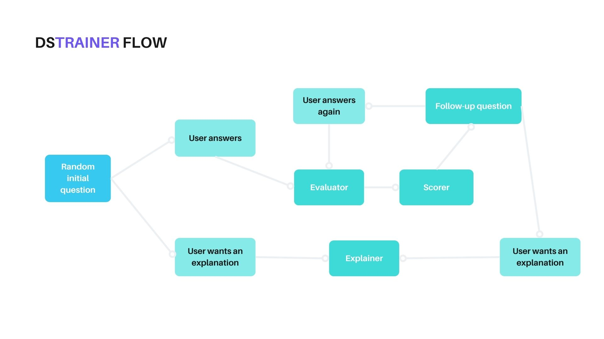
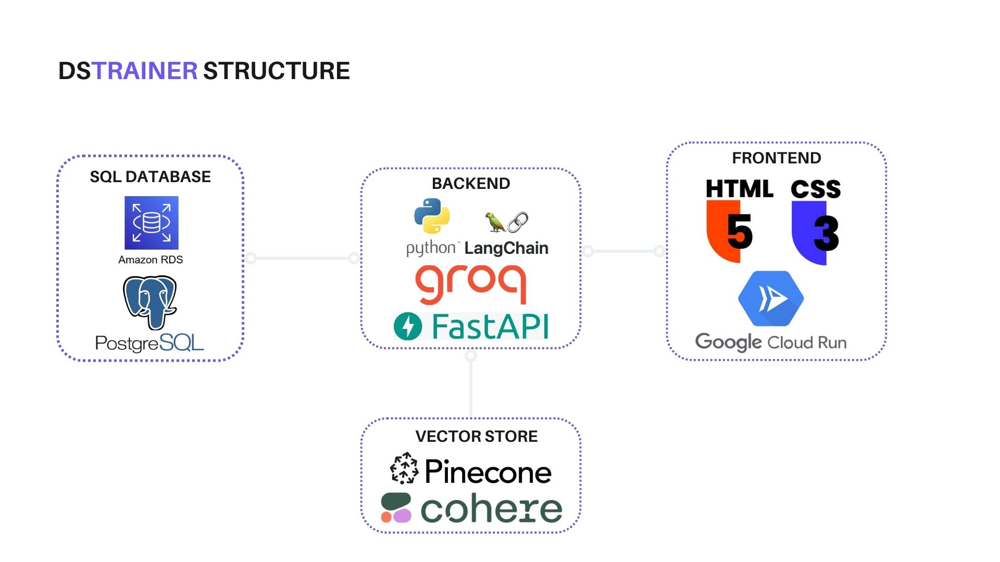

# DSTrainer 🚀

## [ACCESS HERE](https://llm-dstrainer-834289353144.europe-southwest1.run.app/)

DSTrainer is a web-based application designed to simulate Data Science job interview scenarios and assist users in improving their answers to technical and behavioral questions. This application leverages the power of language models to provide feedback, generate follow-up questions, and evaluate user responses.

## 🎯 Features
- **Dynamic Question Generation**: Generates interview questions across multiple domains and skill levels.
- **RAG-enhanced Question Explanation**: You don't know the answer? The model gives you a response, based on vectorized knowledge
- **Follow-up Questions**: Encourages deeper thinking by generating relevant follow-ups.
- **Answer Evaluation**: Grades user responses and provides feedback on how to improve.
- **Interviewer Thoughts**: Simulates the thought process of an interviewer to help users understand their performance.

## 🛠️ Technology Stack
- **Frontend**: HTML, CSS (Bootstrap), hosted on Google Cloud Run.
- **Backend**: Python with FastAPI.
- **AI Integration**: LangChain with Groq Inference, based on llama-3.1-8b-instant.
- **Vector Database**: Pinecone DB, with embeddings made by Cohere (embed-english-light-v3.0).
- **SQL Database**: PostgreSQL, hosted on Amazon RDS.

d

## 🚀 Use the app

**Run the web [here](https://llm-dstrainer-834289353144.europe-southwest1.run.app/)**

## 🚀 Set it up yourself

* You can find a Docker image for both frontend and backend [here](https://hub.docker.com/repository/docker/raugargom/dstrainer), and a preset SQL db [here](https://hub.docker.com/repository/docker/raugargom/dstrainer_db/general).

**Environment variables**
You'll need to set up your own Environment variables, in the following fashion:
- COHERE_API_KEY=
- GROQ_API_KEY=
- PINECONE_API_KEY=
- LANGCHAIN_API_KEY=
- APP_TAG=
- DATABASE_URL=
- DB_HOST=
- DB_PORT=
- DB_NAME=
- DB_USER=
- DB_PASSWORD=

**How to run**

1. On the same folder that there is the .env file, run on your terminal:

``docker run --env-file .env -p 8000:8000 -t raugargom/llm_dstrainer:v2``

2. Go to `localhost:8000` in your preferred web browser.
3. Enjoy your training!
4. Alternatively you can deploy your solution on whichever cloud you prefer. Follow the instructions on docker containers deployment of your cloud provider.

## 📫 Contact

If you have any questions or suggestions, feel free to contact me via:

+ GitHub: [RauGarGom](https://github.com/RauGarGom)
+ Email: [raul.garciagomez@hotmail.com](raul.garciagomez@hotmail.com)
