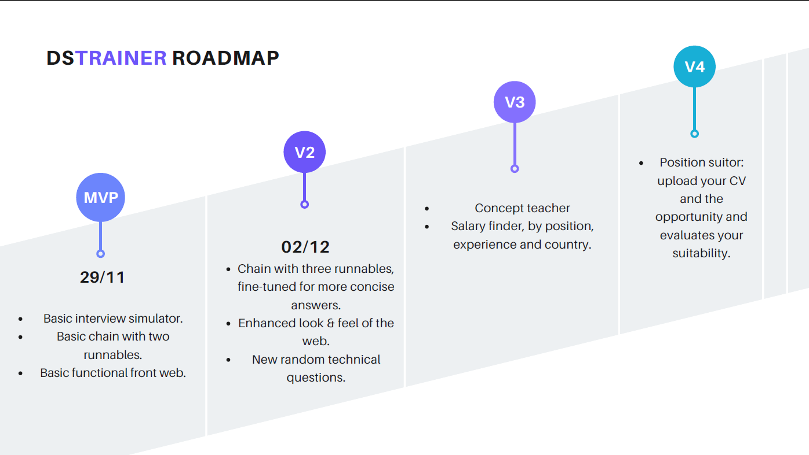

# DSTrainer 🚀

DSTrainer is a web-based application designed to simulate Data Science job interview scenarios and assist users in improving their answers to technical and behavioral questions. This application leverages the power of language models to provide feedback, generate follow-up questions, and evaluate user responses.

## 🎯 Features
- **Dynamic Question Generation**: Generates interview questions across multiple domains and skill levels.
- **Follow-up Questions**: Encourages deeper thinking by generating relevant follow-ups.
- **Answer Evaluation**: Grades user responses and provides feedback on how to improve.
- **Interviewer Thoughts**: Simulates the thought process of an interviewer to help users understand their performance.

## 🛠️ Technology Stack
- **Frontend**: HTML, CSS (Bootstrap).
- **Backend**: Python with FastAPI.
- **AI Integration**: LangChain with Mistral AI.

## 🚀 Getting Started
**Prerequisites**

+ Python 3.8 or higher
+ Docker Desktop
+ A .env file with:
    + LangChain API Key
    + MistralAI API Key
    + Access to the RDS database

**How to run**

1. On the same folder that there is the .env file, run on your terminal:

``docker run --env-file .env -p 8000:8000 -t raugargom/llm_dstrainer:v2``

2. Go to `localhost:8000` in your preferred web browser.
3. Enjoy your training!

## Roadmap

## 📫 Contact

If you have any questions or suggestions, feel free to contact me via:

+ GitHub: [RauGarGom](https://github.com/RauGarGom)
+ Email: [raul.garciagomez@hotmail.com](raul.garciagomez@hotmail.com)
